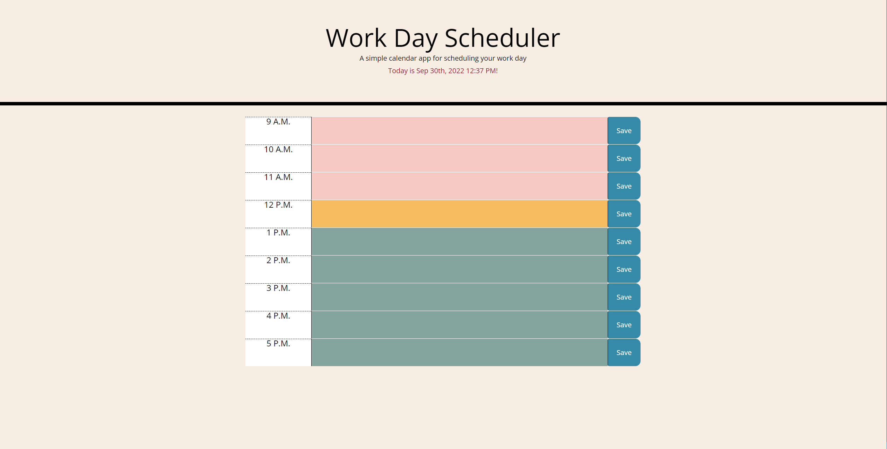
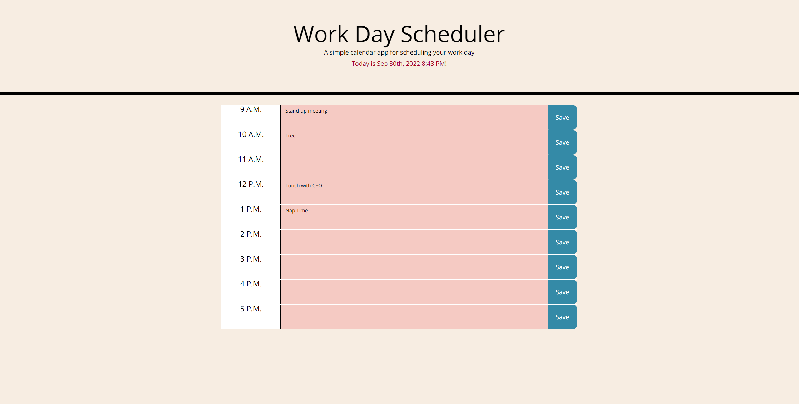

# Work Day Scheduler

## Description

This application is a work day scheduler to add items to the scheduler. The scheduler is color-coded for past, present, and future events. The work day scheduler can be edited by clicking on the box. The event can be saved into local storage with a save button to the side of the text box. The local data is read upon load of the webpage and the text input field will be updated with local storage data. This allows saved data to persist upon webpage load. This website is an exercise in third party API's such as Bootstrap, jQuery, and Moment.js. This project helps keep track of a daily calendar. 

Repo URL:

https://github.com/nambui17/Module-5-challenge

Webpage URL:

https://nambui17.github.io/Module-5-challenge/

## Installation

N/A

## Usage

The website is hosted at the URL:

https://nambui17.github.io/Module-5-challenge

When navigating to the page, the planner should display the current date. After scrolling down, the planner contains blocks of time in intervals of one hour each for a standard work day (9:00 AM to 5:00 PM). Time that has already passed is color-coded pink, the current hour is color-coded orange, and future hours are color-coded green.

On webpage load, all text fields are empty. Past time points have the text field color coded pink. Current time points have the color code orange, and future time points are color coded green. This can be seen in the image below.

An example of a chart with all time points that have passed is shown below.

## Credits

N/A

## License

MIT License. Please refer to the LICENSE in the repo.

## Badges

Badges aren't necessary, but they demonstrate street cred. Badges let other developers know that you know what you're doing. Check out the badges hosted by [shields.io](https://shields.io/). You may not understand what they all represent now, but you will in time.
